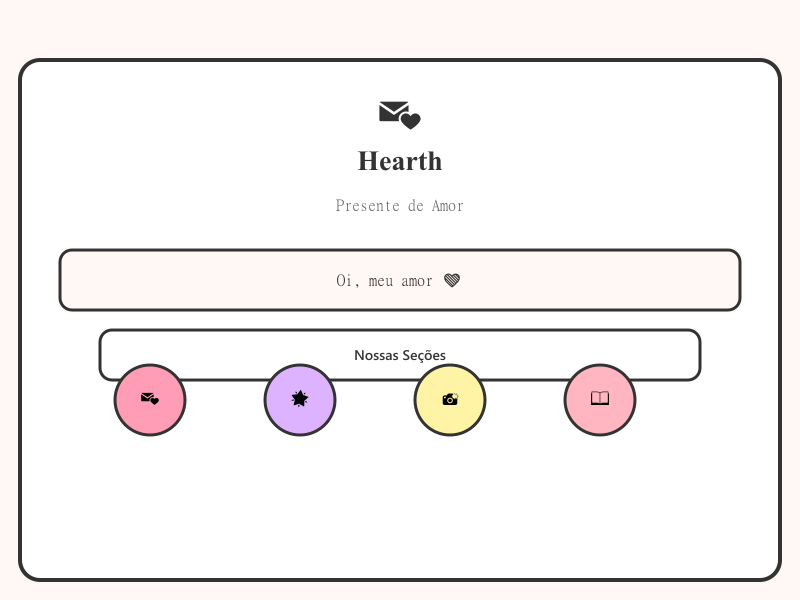

# Hearth - Presente de Amor 💌

Um site PWA (Progressive Web App) mobile-first, criado como um presente romântico digital para sua namorada. Feito com React + Vite, com estética de cards, detalhes românticos e animações delicadas.



## ✨ Características

- **PWA Completa** - Instale como app no celular Android/iOS
- **Mobile-First** - Layout otimizado para celulares
- **Design Romântico** - Cards com bordas pretas grossas, sombras offset, corações e sparkles
- **10 Seções Interativas**:
  - 💖 **Início** - Saudação, contador de dias, navegação por cards
  - 💌 **Cartinhas** - Cartas com animação de abertura de envelope
  - 🌟 **100 Motivos** - Motivos aleatórios de por que você a ama
  - 📸 **Nossas Memórias** - Galeria de fotos com detalhes
  - 📖 **Nossa História** - Timeline vertical dos momentos marcantes
  - 🔒 **Abra quando...** - Cards bloqueados/desbloqueáveis
  - 🎵 **Nossa Trilha Sonora** - Playlist do Spotify integrada
  - 💝 **Dose Diária de Amor** - Mensagens aleatórias de carinho
  - 😢 **Estou com Saudade** - Interação divertida para quando sente falta
  - ⭐ **Surpresa Secreta** - Tela oculta desbloqueada por clique

## 📦 Tecnologias

- **React 19** - Biblioteca JavaScript
- **Vite 5** - Build tool e dev server
- **React Router DOM 7** - Navegação entre páginas
- **Vite Plugin PWA** - Suporte completo a PWA
- **Date-fns** - Formatação de datas

## 🚀 Como Executar Localmente

### Pré-requisitos

- Node.js >= 20
- npm ou yarn

### Instalação

```bash
# Clone o repositório (ou acesse a pasta)
cd hearth

# Instale as dependências
npm install

# Inicie o servidor de desenvolvimento
npm run dev

# Acesse http://localhost:5173
```

### Build para Produção

```bash
npm run build

# Visualize a build de produção
npm run preview
```

## 🌐 Hospedagem no GitHub Pages

Este projeto está configurado para deploy automático no GitHub Pages.

### Deploy Automático (CI/CD)

1. Push para a branch `main` ou `master`:
```bash
git add .
git commit -m "Deploy"
git push origin main
```

O GitHub Actions vai automaticamente fazer o build e deploy para `https://tilek64.github.io/hearth`

### Deploy Manual

```bash
npm run build
npm run deploy
```

## ⚙️ Personalização

Tudo é configurado no arquivo `src/data/config.ts`.

### 🔧 Pontos Exatos para Editar

| Campo | Descrição | Exemplo |
|-------|-----------|---------|
| `girlfriendName` | Nome da sua namorada | `"Maria"` |
| `yourName` | Seu nome | `"João"` |
| `relationshipStartDate` | Data de início do relacionamento | `"2023-06-15"` |
| `spotifyPlaylistUrl` | Link da playlist do Spotify | `"https://open.spotify.com/playlist/xxx"` |
| `profilePhoto` | Foto de perfil (coloque em `public/`) | `"/minha-foto.png"` |
| `homePhoto` | Foto na home | `"/foto-home.png"` |
| `greetingMessage` | Mensagem de saudação | `"Oi, meu amor ❤️"` |
| `introMessage` | Frase introdutória | `"Cada dia ao seu lado é um presente."` |
| `secretMessage` | Mensagem da surpresa secreta | `"Texto customizado..."` |
| `favoriteColor` | Cor favorita | `"#ffb3ba"` |

### 📝 Como Editar

1. Abra `src/data/config.ts`
2. Substitua os placeholders:
   - `[NOME DELA]` → nome real da sua namorada
   - `[SEU NOME]` → seu nome completo
   - `[DATA DO NAMORO]` → data de quando vocês começaram (formato: `AAAA-MM-DD`)
   - `[LINK SPOTIFY]` → link da sua playlist compartilhada

3. Para fotos: adicione imagens na pasta `public/` e atualize os caminhos na config

4. Para adicionar mais motivos, cartas, memórias, eventos da timeline, etc.:
   - **Motivos**: Adicione strings no array `reasons`
   - **Cartas**: Adicione objetos no array `letters`
   - **Memórias**: Adicione objetos no array `memories`
   - **Timeline**: Adicione objetos no array `timeline`
   - **Mensagens diárias**: Adicione strings no array `dailyLoveMessages`
   - **Mensagens de saudade**: Adicione strings no array `saudadeMessages`

### 🎵 Configurando a Playlist do Spotify

1. Crie uma playlist no Spotify
2. Clique em "Compartilhar" → "Copiar link da playlist"
3. Cole o link em `spotifyPlaylistUrl`:
```ts
spotifyPlaylistUrl: "https://open.spotify.com/playlist/SEU_ID_AQUI"
```

## 📁 Estrutura do Projeto

```
hearth/
├── public/
│   ├── favicon.svg
│   ├── pwa-192x192.png
│   ├── pwa-512x512.png
│   ├── apple-touch-icon.png
│   ├── maskable-192x192.png
│   ├── maskable-512x512.png
│   ├── screenshot-home.png
│   └── nojekyll
├── src/
│   ├── assets/
│   ├── components/
│   │   ├── Card.tsx
│   │   ├── Envelope.tsx
│   │   ├── Gallery.tsx
│   │   ├── Layout.tsx
│   │   └── Timeline.tsx
│   ├── data/
│   │   └── config.ts          ← TODOS OS TEXTOS E CONFIGURAÇÕES
│   ├── hooks/
│   │   └── index.ts
│   ├── pages/
│   │   ├── Home.tsx
│   │   ├── Letters.tsx
│   │   ├── Reasons.tsx
│   │   ├── Memories.tsx
│   │   ├── Story.tsx
│   │   ├── WhenOpen.tsx
│   │   ├── Soundtrack.tsx
│   │   ├── DailyLove.tsx
│   │   ├── Saudade.tsx
│   │   └── Surprise.tsx
│   ├── styles/
│   │   └── global.css
│   ├── utils/
│   │   └── index.ts
│   ├── App.tsx
│   └── main.tsx
├── .github/workflows/
│   └── deploy.yml
├── vite.config.ts
├── package.json
└── README.md
```

## 🎨 Customizando o Visual

As cores e estilos estão em `src/styles/global.css`. Variáveis principais:

```css
:root {
  --bg-primary: #fff8f5;        /* Fundo geral */
  --bg-card: #ffffff;            /* Fundo dos cards */
  --border-dark: #333333;       /* Cor das bordas */
  --accent-pink: #ff9db6;       /* Rosa principal */
  --accent-rose: #ffb6c1;       /* Rosa claro */
  --accent-red: #ffb3b3;        /* Vermelho suave */
  --accent-purple: #ddb3ff;     /* Lilás claro */
  --accent-yellow: #fff3a6;     /* Amarelo pastel */
  --accent-gold: #ffd6a5;       /* Dourado suave */
}
```

## 📱 Instalando como App

Depois de publicado no GitHub Pages:

1. Acesse o site no seu navegador de celular
2. Clique nos 3 pontos do navegador (Chrome)
3. Selecione "Adicionar à tela inicial"
4. Confirme e o app aparecerá como um ícone na sua tela inicial!

## 🛠️ Scripts Úteis

| Script | Descrição |
|--------|-----------|
| `npm run dev` | Inicia o servidor de desenvolvimento |
| `npm run build` | Cria build de produção |
| `npm run preview` | Visualiza a build de produção |
| `npm run lint` | Executa o linter |
| `npm run deploy` | Faz deploy para GitHub Pages |
| `node scripts/generate-icons.js` | Regenera ícones PWA |
| `node scripts/generate-screenshot.js` | Regenera screenshot do manifesto |

## 🐛 Problemas Comuns

- **Build falha?** - Certifique-se de ter Node.js >= 20
- **PWA não aparece?** - Use HTTPS ou localhost para testar
- **Playlist não carrega?** - Verifique se a playlist é pública no Spotify

## ❤️ Feito com Amor

Este presente digital foi criado especialmente para celebrar o amor. Cada card, animação e detalhe foi pensado para transmitir carinho e exclusividade.

- [Seu Nome] + ❤️ + [Nome da Namorada] = 💖
